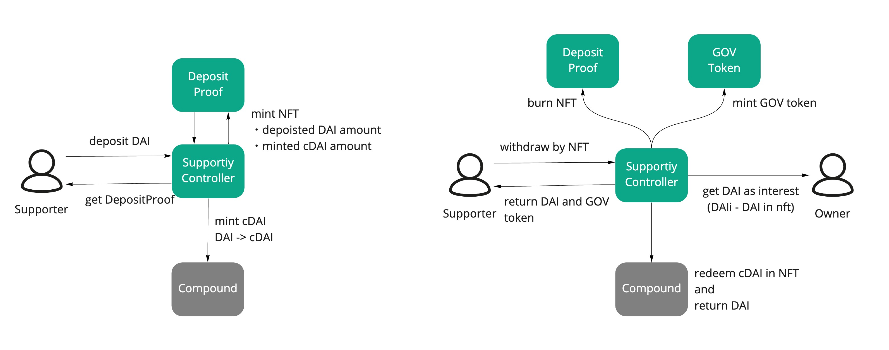

## Disclaimer

This project is in alpha.
Use at your own risk and you must not use this contract in mainnet.

## Supportiy: New Support Scheme

Supportiy is a new support schema that allows continuous support by sending the interest earned using the lending protocol such as Compound to those who want to support.

## Architecture



## Usage

Because of truffle-based development, we use truffle in deployment and compilation.

#### Deployments

First create .env file with reference to .env.sample to set the environment variables.

```sh
truffle migrate --network rinkeby
```

#### Development

Compile contract code.

```sh
truffle compile
```

Call Supportiy contract.

```sh
# yarn ts-node scripts/<typescript>.ts

yarn ts-node scripts/setIssuer.ts
```

#### Plan

- Create frontend app to connect Supportiy contract
- Develop a builder contract for easy setup of a Supportiy
- Add test to guarantee the operation of Contract
- Documents
